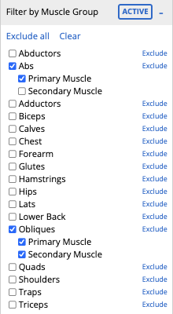
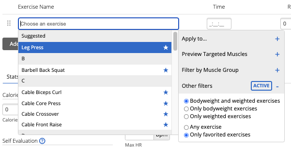

[![][build-shield]][build-url]
[![MIT License][license-shield]][license-url]
[![Lit][lit-shield]][lit-url]

# Enhancements for Garmin Connect Web

Upgrade your experience using Garmin Connect on Web with an enhanced exercise search, filtering by muscle groups, previews, and more.

Available as a Chrome extension / Firefox add-on or [installed via a UserScript manager](https://github.com/Wassup789/garmin-connect-enhancements/releases/latest/download/garmin-connect-enhancements.user.js
) ([Violentmonkey](https://violentmonkey.github.io) or [Tampermonkey](https://www.tampermonkey.net)).

## Features
<!-- TOC -->
  * [Improved exercise search](#improved-exercise-search)
  * [Filter exercises by muscle group](#filter-exercises-by-muscle-group)
  * [Preview an exercise's muscle group targets](#preview-an-exercises-muscle-group-targets)
  * [Apply the same exercise to multiple sets at once](#apply-the-same-exercise-to-multiple-sets-at-once)
  * [Exercise weight retention](#exercise-weight-retention)
  * [Favoriting exercises](#favoriting-exercises)
<!-- TOC -->

### Improved exercise search

The original implementation when searching for workouts require an exact match
when typing a workout name and does not automatically select the most relevant workout.

The following demos showcase the improvements made to the original implementation: 

| Description                                           | Original Implementation vs Enhanced Search                                                                                                                                                                                                                                    |
|-------------------------------------------------------|---------------------------------------------------------------------------------------------------------------------------------------------------------------------------------------------------------------------------------------------------------------------------------------------------|
| Enabling out-of-order and partial word search         | <video height="300" src="https://github.com/Wassup789/garmin-connect-enhancements/assets/1007707/b1a59d31-3afd-4437-9f89-59770aa7b97b"></video>                                                                                                                                                   |
| Automatically selecting workouts by it's relevancy     | <video height="300" src="https://github.com/Wassup789/garmin-connect-enhancements/assets/1007707/ce328715-4d4c-4064-b961-7585527ec1f1"></video>                                                                                                                                                   |
| Improved search for diacritics and special characters | <video height="300" src="https://github.com/Wassup789/garmin-connect-enhancements/assets/1007707/7acb2a4c-c9e1-40e4-b7a1-dfb7d7d7a648"></video> <video height="300" src="https://github.com/Wassup789/garmin-connect-enhancements/assets/1007707/f5bbd4b0-d8b3-4429-b0b0-e9898dba4abb"></video> |

### Filter exercises by muscle group

Finding the most relevant workout exercise can be difficult within Garmin Connect, 
as there could be many different names for the same workout and the exercise list from Garmin
may only have one of those variants.

When searching for workouts, this enhancement allows the ability to find workouts that target specific
muscle groups, find workouts that primarily or secondarily target a specific muscle group or exclude the muscle group entirely.

### Preview an exercise's muscle group targets

While searching for a specific exercise, a preview window displays the exercise's targeted muscle groups and whether it's a primary or secondary target.

<video height="300" src="https://github.com/Wassup789/garmin-connect-enhancements/assets/1007707/716dbc47-3576-4dd6-88f0-d1c2baaaca20"></video>

### Apply the same exercise to multiple sets at once

Perfect for when your workout has one type of exercise or if you are performing supersets. When selecting
an exercise, an option is added to apply the exercise to all the other sets, sets that precede the current set,
every other set, and more.

<video height="300" src="https://github.com/Wassup789/garmin-connect-enhancements/assets/1007707/73eee228-b025-46ee-b434-db2ce3975e0e"></video>

### Exercise weight retention

When using your Garmin watch to predict the exercise name, it may select a bodyweight exercise even when you
select a weight for your set. An unfortunate consequence of this, is when you edit and save the exercise,
you may lose the weight you manually set for the exercise.

This fix ensures that when modifying any exercise, the previously entered weight will always persist
and not disappear back to bodyweight when saving.

#### Demo (above is original, below is fix)
<video height="330" src="https://github.com/Wassup789/garmin-connect-enhancements/assets/1007707/fad123c7-fee9-4156-b93f-aaa8398e050d"></video>

### Favoriting exercises

Favorite the exercises you frequently use to access them effortlessly later.

**Note: this feature only saves on the device you are using and does not sync cross-devices**

## Development

[See INSTALL.md](INSTALL.md)

[license-shield]: https://img.shields.io/badge/License-MIT-green.svg?style=for-the-badge
[license-url]: LICENSE
[build-shield]: https://img.shields.io/github/actions/workflow/status/Wassup789/garmin-connect-enhancements/build?style=for-the-badge
[build-url]: https://github.com/Wassup789/garmin-connect-enhancements/actions/workflows/build.yml
[lit-shield]: https://img.shields.io/badge/lit-334eff?style=for-the-badge&logo=lit&logoColor=white
[lit-url]: https://lit.dev/
